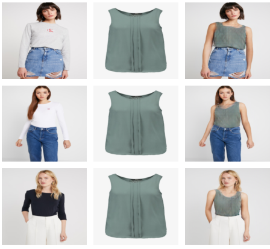
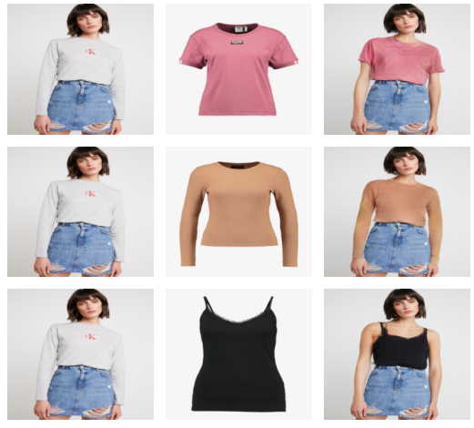
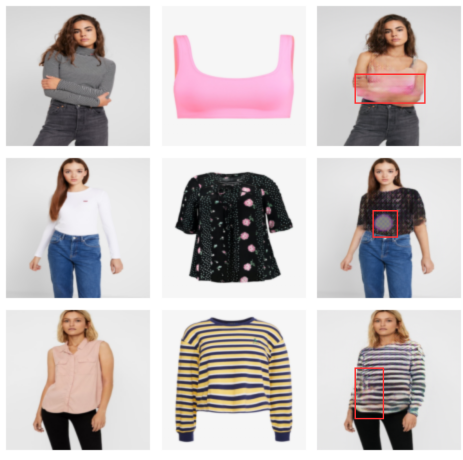

# 🧥 Multi U-Net Based Virtual Try-On System

A **resource-efficient virtual try-on (VTON) framework** based on a **Multi U-Net architecture with Self-Excitation (SE) blocks** for realistic image-to-image garment fitting.  
The system balances **structural alignment**, **identity preservation**, and **computational efficiency**, making it suitable for real-world deployment on limited hardware.

---

## 📌 Overview

Virtual Try-On (VTON) systems allow users to visualize garments on human images before purchase, reducing return rates and improving customer experience in e-commerce.

This project proposes a **two-stage U-Net pipeline**:
1. **Segmentation U-Net** – Generates an agnostic person representation.
2. **Translational U-Net** – Synthesizes the final try-on image by fusing garment and person features using **Self-Excitation blocks**.

The model is trained and evaluated on the **VITON-HD dataset**.

---

## 🏗️ Architecture

- U-Net encoder–decoder with skip connections  
- Self-Excitation (SE) blocks for channel attention  
- Two-stage pipeline: segmentation followed by translation  

  
  

---

## 📂 Dataset

**VITON-HD** (CVPR 2021)

| Attribute | Value |
|---------|------|
| Number of Image Pairs | 13,679 |
| Train / Test Split | 11,647 / 2,032 |
| Image Resolution | 1024 × 768 |
| License | CC BY-NC 4.0 |

---

## ⚙️ Training Configuration

  

- **Optimizer:** Adam  
- **Epochs:** 150  
- **Learning Rate:** 1e-3 → 1e-5  
- **Input Resolution:** 224 × 224  
- **GPU:** NVIDIA RTX 3050 (4GB VRAM)

---

## 📊 Results

### 🔢 Quantitative Results

The following metrics were computed on the VITON-HD test set.

| Method | SSIM ↑ | LPIPS ↓ | FID ↓ |
|------|-------|--------|------|
| CP-VTON | 0.785 | 0.2871 | 48.86 |
| VITON-HD | 0.848 | 0.1216 | 12.81 |
| HR-VITON | 0.860 | 0.1038 | 9.92 |
| **Proposed Method** | **0.8574** | **0.1941** | **23.87** |

---

### 🖼️ Qualitative Results

Examples of virtual try-on results generated by the proposed method.  
Each example shows garment transfer across different body poses and clothing styles.

  
  

---

### ⚠️ Failure Cases

Some challenging examples where misalignment or texture distortion occurs.

  

---

## 📜 License

For **research and academic use only**.  
Dataset usage follows **VITON-HD (CC BY-NC 4.0)** licensing.

---

## 🛠️ Tools Used

- **Programming Language:** Python  
- **Deep Learning Framework:** PyTorch  
- **Image Processing:** Pillow  
- **Data Handling:** NumPy, Pandas  
- **Visualization:** Matplotlib  
  
